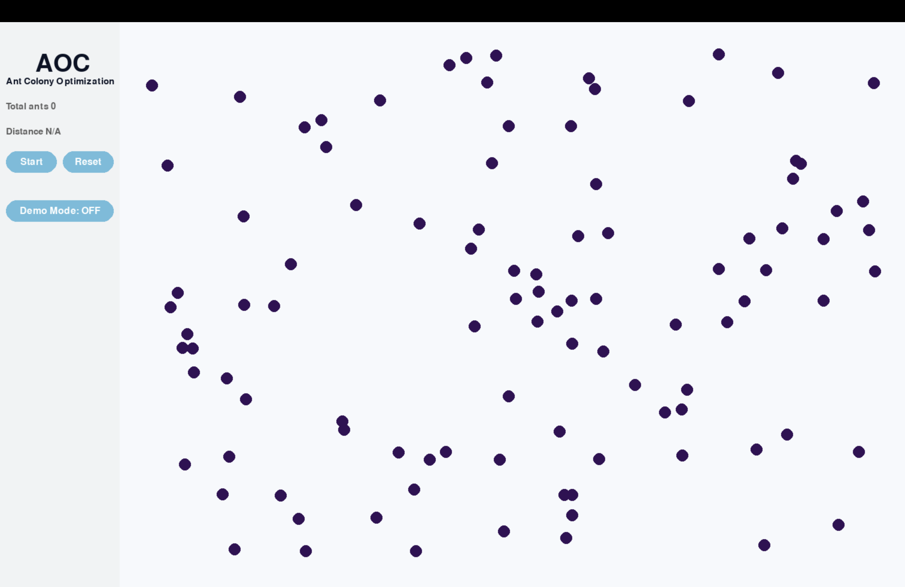

[](https://www.python.org/) [](https://github.com/Naereen/StrapDown.js/blob/master/LICENSE)


# Solving TSP with Ant Colony Optimization

This project is a Python implementation of Ant Colony Optimization (ACO) to solve the Traveling Salesman Problem (TSP). The program is developed in Python, using Pygame for visualization, and developed with the PyCharm IDE.

## Traveling Salesman Problem
TSP is a classic optimization problem in the field of computer science and operations research. The problem consists of finding the shortest possible route for a salesman who needs to visit a set of cities, visiting each city exactly once and returning to the starting city. The TSP is well-known for its simplicity in terms of understanding the problem statement, but it is also notoriously difficult to solve optimally as the number of cities increases. This problem belongs to the class of NP-hard problems, which means that finding an exact solution in a reasonable time is challenging, especially for large instances. As a result, various heuristic and approximation algorithms, such as Ant Colony Optimization, have been developed to find near-optimal solutions efficiently.


##### Selecting next node
The TSP is solved by calculating the desirability of possible routes using the following function:

```python
    desirability = math.pow(1 / distance, Settings.DESIRABILITY_POWER) * math.pow(pheromone, Settings.PHEROMONE_POWER)
```

The next node is then selected using a roulette wheel approach based on the list of desirabilities. All parameters can be adjusted in the `Settings` class.


## GUI

The GUI includes three buttons: 
##### Star/Pause
Starts and pauses de simulation.
##### Reset
Creates a new random set of nodes for a new simulation.
##### Demo Mode
This button enables/disables the Demo Mode.

In Demo mode, the program slowly visualizes the path followed by the ants, the current node, the possible paths (with line thickness based on desirability), and the next node. The process is repeated until all nodes have been visited. The total distance and sequence are stored, and if a new, shorter path is found, it is saved and the UI is updated. The speed of Demo mode can be increased by reducing the delay with `Settings.DELAY *= 0.95`.
<p float="left">
  
  
  
</p>

## Installation

To install the required libraries, run the following command:

```bash
pip install pygame
```

## Usage

To run the program, simply execute the following command:

```bash
python main.py
```
<p float="left">
  
  
  
  
</p>

## Configuration
##### Ant Colony Parameters
It is possible to adjust the initial number of ants and the number of nodes, by default it will have 100 Nodes and will add one ant on each iteration.
```python
class Settings:
    NUM_NODES = 100
    INITIAL_ANTS = 0
    
    DESIRABILITY_POWER = 4
    PHEROMONE_POWER = 2
    PHEROMONE_INITIAL = 1
    PHEROMONE_INTENSITY = 10
    PHEROMONE_EVAPORATION = 0.3
```

##### UI Parameters
It is possible to adjust some elements of the UI; here are the parameter with its default values.
```python
class Settings:
    NODE_RADIUS = 10
    LINE_THICKNESS = 4
    NODE_OPTIONS_THICKNESS = NUM_NODES // 2

    # Animation
    ANIMATION_SPEED = 0.05

    # Colors on HEX
    BACKGROUND_COLOR = pygame.Color('#F7F9FC')
    SIDEBAR_COLOR = pygame.Color('#F1F3F4')
    TITLE_COLOR = pygame.Color('#0a1225')
    TEXT_COLOR = pygame.Color('#5E5E5E')
    BUTTON_COLOR = pygame.Color('#6CBDDC')
    NODE_COLOR = pygame.Color('#321055')
    LINE_COLOR = pygame.Color('#A391B7')
    NODE_OPTIONS_COLOR = pygame.Color('#858F9E')
    SELECTED_NODE_COLOR = pygame.Color('#0C203D')

    #Sizes
    TEXT_SIZE = 22
    SIDEBAR_WIDTH = 200
    UI_PADDING = 10
    LABEL_WIDTH = 170
    BUTTON_WIDTH = 85
    BUTTON_WIDTH_FULL = 180
    BUTTON_HEIGHT = 20
    ROW_PADDING = 20
    PADDING = 50
```

## Future Work
- [ ] UI Improvements
  - [ ] Modify total nodes
  - [ ] Set the amount of ants
- [ ] Use genetic algorithm to modify the colony parameters
- [ ] Implement other functions for desirability
- [ ] Run multiple colonies on parallel
- [ ] Test on GPU
- [ ] Add manual of usage
- [ ] Add documentation
- [ ] Add examples

## License

This project is for the Advanced Numerical Computing class at Universidad Politécnica de Madrid for the Master's in Software and Systems. The author is Kenny Orellana, and the project is licensed under the MIT License.